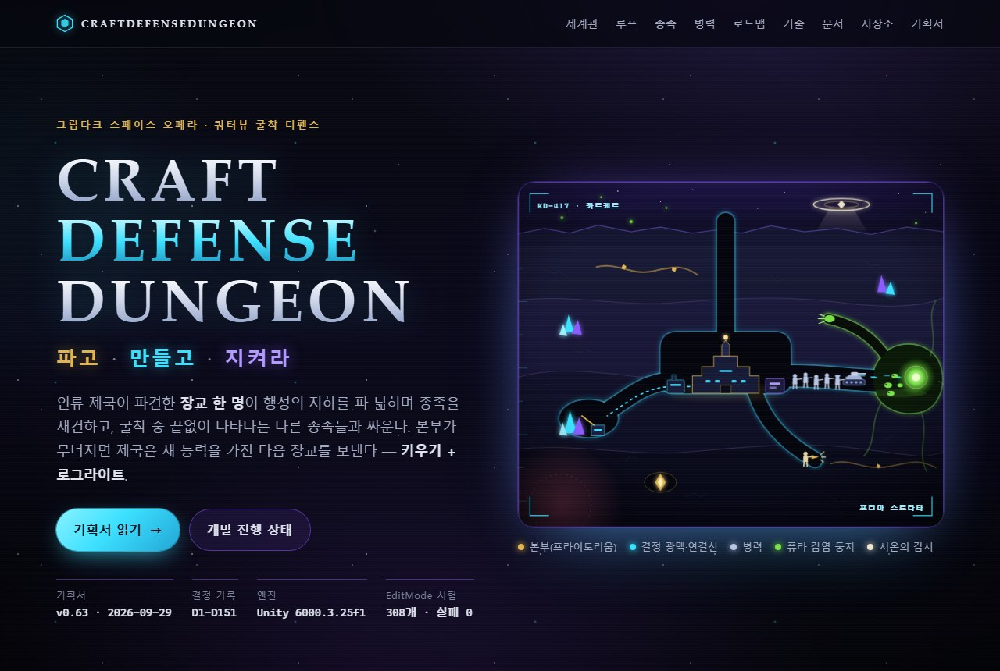

# CraftDefenseDungeon

### 파고 · 만들고 · 지켜라

그림다크 스페이스 오페라 · 쿼터뷰 **굴착·건설·디펜스** 게임 (키우기 + 로그라이트)

**[▶ 소개 페이지 열기](https://blackbuddle.github.io/CraftDefenseDungeon-Docs/)** · [기획서 읽기](https://blackbuddle.github.io/CraftDefenseDungeon-Docs/game-plan.html) · [개발 로드맵](https://blackbuddle.github.io/CraftDefenseDungeon-Docs/#roadmap)

> **개발 중인 게임입니다.** 지금은 도형만으로 규칙을 검증하는 시제품(회색 박스) 단계라서, 내려받아 플레이할 수 있는 빌드는 아직 없습니다. 이 저장소에는 소개 페이지와 기획·설계 문서만 있고, 게임 소스 코드는 비공개 저장소에서 관리합니다.

## 어떤 게임인가요?

인류 제국은 정복 전쟁을 벌이고 있지만, 행성마다 대군을 보내지는 않습니다. **장교 한 명**을 행성 지하로 내려보낼 뿐입니다. 지표는 시온의 감시와 퓨라의 포자에 덮여 있어서, 들키지 않고 불어날 수 있는 곳은 지하뿐이기 때문입니다.

장교는 제국의 기술로 지하를 파 넓히고, 도구를 만들고, 그 도구로 병력을 길러 굴착 중 끝없이 나타나는 다른 종족과 싸웁니다. 본부가 무너지면 한 판이 끝나고, 제국은 새 능력을 가진 다음 장교를 보냅니다. 처음부터 다시, 하지만 더 강하게.

## 한 판은 이렇게 흘러갑니다

| | | |
|---|---|---|
| **파고** | 굴착 | 굴착병이 정해 둔 방침(자원·확장·안전·목표 지점…)대로 블록을 캐서 지하를 넓힙니다. 단단한 암반은 시간을 버는 벽이 됩니다. |
| **만들고** | 제작·경제 | 채굴기·제련소·조합 건물을 연결선으로 이어 두면 도구가 자동으로 만들어집니다. 초반 광산을 끝까지 지킬 이유가 생깁니다. |
| **지켜라** | 병력·전투 | 도구가 곧 병사입니다. 병참 건물이 병종별 목표 수만큼 병력을 유지하고, 전투 유닛은 정해 둔 방침 순서대로 싸웁니다. 적 기지를 부수면 자원이 흐르고 굴착할 수 있는 영역이 넓어집니다. |

한 판이 끝나도 번 재화는 남습니다. 강화 트리, 장교·동료 영입, 유물 강화로 다음 판을 더 강하게 시작합니다.

## 이런 점이 특징입니다

- **정해 두고 지켜보는 자동화** — 생산 속도·병종·건물 우선순위 같은 방침을 정하면 기지는 알아서 돌아갑니다. 돌아가는 모습 자체가 보는 맛입니다.
- **굴착이 곧 위험 선택** — 어디를, 얼마나 멀리 팔지가 난이도를 정합니다.
- **무너져도 남는 성장** — 본부가 무너져도 번 만큼은 남고, 다음 장교는 더 강하게 시작합니다.

## 만나게 될 세력

처음에는 인류 제국만 플레이할 수 있습니다.

- **인류 제국** (플레이어블) — 자원만 있으면 한 사람이 종족 전체를 다시 재건할 수 있는 기술을 가졌습니다. 장교의 병과 10개가 이번 판 군대의 특성을 정합니다.
- **퓨라** (적) — 바이러스로 모든 개체를 같은 개체로 만들어 순수하게 "하나"가 되려는 하이퍼마인드. 감염 영역을 넓히며 광맥을 먹고, 굴을 파서 다가옵니다.
- **시온** (적) — 자기 종족 외 모두를 저급 종족으로 보면서도 "고등 종족의 의무"로 우주 경찰을 자처하는 천사들.
- **오라클** (현상) — 기쁨·증오·빛·물 같은 "개념 그 자체". 처음 버전에서는 맵 전체에 번지는 위험 구역으로 나타납니다.

## 지금 어디까지 왔나요? (2026-09-29 기준)

굴착, 자원·도구 경제, 유닛 생산과 병참, 전투, 적 기지와 전선이 회색 박스로 만들어져 있습니다. 지금은 좁은 굴에서 유닛이 서로 밀고 지나가는 이동·충돌 방식을 새로 다듬는 단계입니다. 단계별 상태는 [소개 페이지의 개발 로드맵](https://blackbuddle.github.io/CraftDefenseDungeon-Docs/#roadmap)에서 볼 수 있습니다.

## 문서

기획서와 설계서를 브라우저에서 바로 읽을 수 있습니다.

- [**기획서**](https://blackbuddle.github.io/CraftDefenseDungeon-Docs/game-plan.html) — 게임 개요, 결정 기록, 단계표
- **설계서**
  - [P1·P9 프로젝트 준비와 운영 서버](https://blackbuddle.github.io/CraftDefenseDungeon-Docs/specs/2026-09-28-p1-p9-setup-liveops-design.html)
  - [P2 지하 굴착·확장](https://blackbuddle.github.io/CraftDefenseDungeon-Docs/specs/2026-09-25-p2-digging-design.html)
  - [P3 자원·도구 제작 경제](https://blackbuddle.github.io/CraftDefenseDungeon-Docs/specs/2026-09-25-p3-economy-design.html)
  - [P4 유닛 생산·병참](https://blackbuddle.github.io/CraftDefenseDungeon-Docs/specs/2026-09-25-p4-units-design.html)
  - [P5 조우·침공](https://blackbuddle.github.io/CraftDefenseDungeon-Docs/specs/2026-09-25-p5-encounters-design.html)
  - [P5b 적 기지와 전선](https://blackbuddle.github.io/CraftDefenseDungeon-Docs/specs/2026-09-29-p5b-enemy-bases-design.html)
  - [P5c 이동·충돌 모델 개편](https://blackbuddle.github.io/CraftDefenseDungeon-Docs/specs/2026-09-29-p5c-movement-collision-design.html)
  - [P6 종족·지역 확장 프레임워크와 관리자 도구](https://blackbuddle.github.io/CraftDefenseDungeon-Docs/specs/2026-09-26-p6-extension-design.html)
  - [P7 세계관·서사](https://blackbuddle.github.io/CraftDefenseDungeon-Docs/specs/2026-09-28-p7-lore-design.html)
  - [P8 성장·메타 진행](https://blackbuddle.github.io/CraftDefenseDungeon-Docs/specs/2026-09-26-p8-progression-design.html)

## 자주 묻는 것

**플레이해 볼 수 있나요?** 아직 배포하는 빌드는 없습니다. 개발용 시제품을 Unity 에디터에서 돌려 보는 단계입니다.

**소스 코드는 볼 수 있나요?** 게임 소스 코드는 비공개입니다. 이 저장소에는 소개 페이지와 기획서·설계서만 공개합니다.

**작업용 이름인가요?** 네, `CraftDefenseDungeon`은 작업용 이름이라 바뀔 수 있습니다.

## 라이선스

미정.
